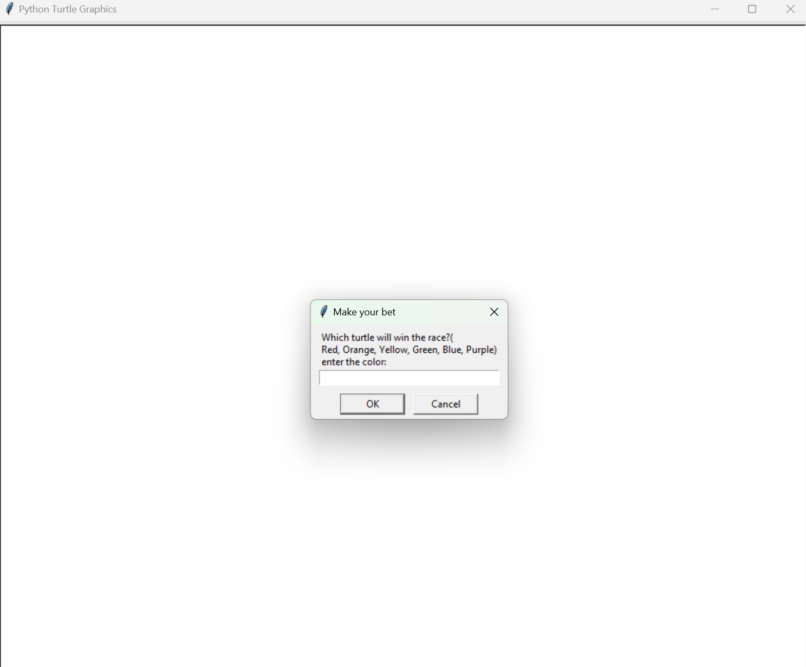
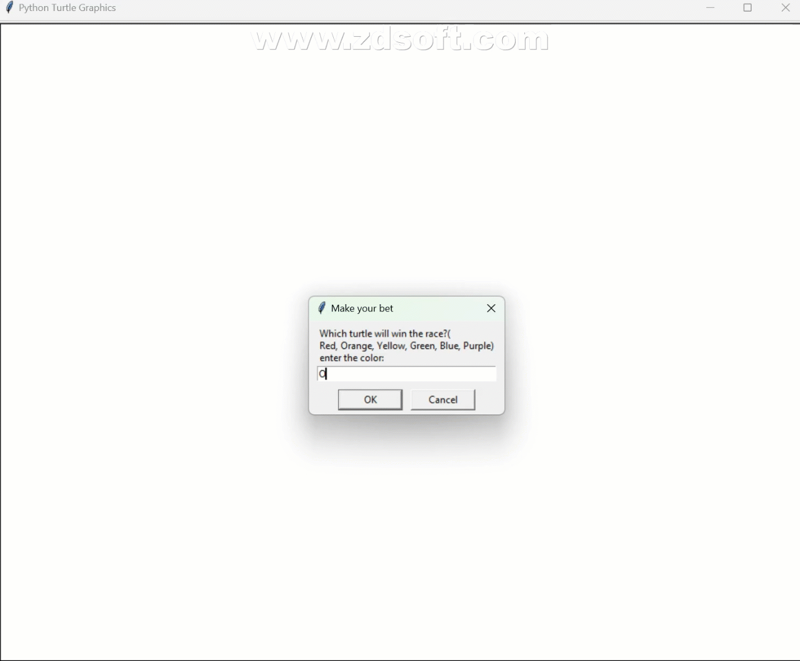

**Turtle Race Simulator 🐢**

Welcome to the Turtle Race Simulator — a thrilling Python-based game that brings the excitement of turtle racing to your screen! Using Python's powerful turtle graphics module, this interactive script lets you place bets, cheer for your favorite turtle, and enjoy the randomness of a fast-paced virtual race.

Whether you're a Python beginner exploring basic programming concepts or a seasoned developer looking for a bit of fun, this simulator offers a delightful blend of simplicity and excitement.

**Features:**

🐢 Interactive Betting: Choose your favorite turtle (Red, Orange, Yellow, Green, Blue, or Purple) and place a bet to see if luck is on your side.

🎲 Randomized Speeds: Each turtle moves forward at a random pace, ensuring an unpredictable and exciting race every time.

🏆 Live Results: Get real-time updates on the race progress and find out if your chosen turtle is the winner.

🎨 Vivid Visuals: Enjoy colorful turtle animations and a visually appealing race track setup.

**How to Play**

**Run the Script:**

1. Open the script in your Python environment and execute it.

**Place Your Bet:**

1. A prompt will appear asking you to select the turtle you think will win the race.
2. Type your chosen color (e.g., Red, Orange, Yellow, etc.) and press Enter.
   

**Watch the Race:**

1. Sit back and watch as the turtles compete to cross the finish line.
2. Cheer for your chosen turtle as it races towards victory!

**Check the Results:**

1. After the race ends, the winner's color is announced along with a message letting you know if you won or lost your bet.
